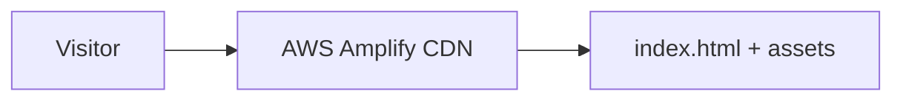

# iamroidev

Personal portfolio and technical showcase for **Richard Kwaku Opoku** — cloud engineering, cybersecurity, and full-stack projects shipped to production.

**Live:** [devroi.site](https://devroi.site) (AWS Amplify)

---

## Overview

iamdevroi is my **static, zero-build** portfolio site. Each section is a full-viewport slide with its own visual theme, linking to production work including QUADS, Apex Classroom, StudyMate, RoiTube, and AniStream.

There is no bundler, framework, or backend — only HTML, CSS, and vanilla JavaScript deployed as static assets.

---

## System Design



| Concern | Approach |
|---------|----------|
| Hosting | AWS Amplify static hosting |
| Navigation | Client-side slide controller (`main.js`) |
| Assets | Self-contained `img/`, `style.css` |
| CV tooling | Optional `cv-work/` Python scripts (maintainer only, not runtime) |

---

## Features

- Full-page slide navigation with progress markers and table of contents
- Per-slide gradient themes (Intro, AWS, Scholar, Quads, Apex, StudyMate, …)
- Featured projects grid with links to live repositories
- Skills taxonomy and downloadable resume/CV
- Responsive layout, Open Graph meta tags, skip-link accessibility

---

## Technology Stack

| Layer | Technology |
|-------|------------|
| Markup | HTML5 |
| Styling | CSS3 (custom properties, gradients, responsive grid) |
| Behavior | Vanilla JavaScript (ES6+) |
| Deploy | AWS Amplify (`amplify.yml`) |
| Maintainer tools | Python (`cv-work/pack.py`, `update_cv.py`) |

---

## Getting Started

```bash
git clone https://github.com/iamroidev/devroi.git
cd devroi
```

Open `index.html` in a browser, or serve locally:

```bash
npx serve .
```

No install step or environment variables required.

---

## Deployment

Amplify builds from the repository root with no compile step:

```yaml
# amplify.yml — artifact is the repo root
```

Push to the connected branch; Amplify publishes static files to the CDN.

---

## Project Structure

```
devroi/
├── index.html       # Single-page shell
├── style.css        # Themes and layout
├── main.js          # Slide navigation logic
├── img/             # Favicon and project visuals
├── amplify.yml      # Amplify build spec
└── cv-work/         # CV docx maintenance scripts (optional)
```

---

## License

MIT — see [LICENSE](LICENSE).

**Author:** [iamroidev](https://github.com/iamroidev)
